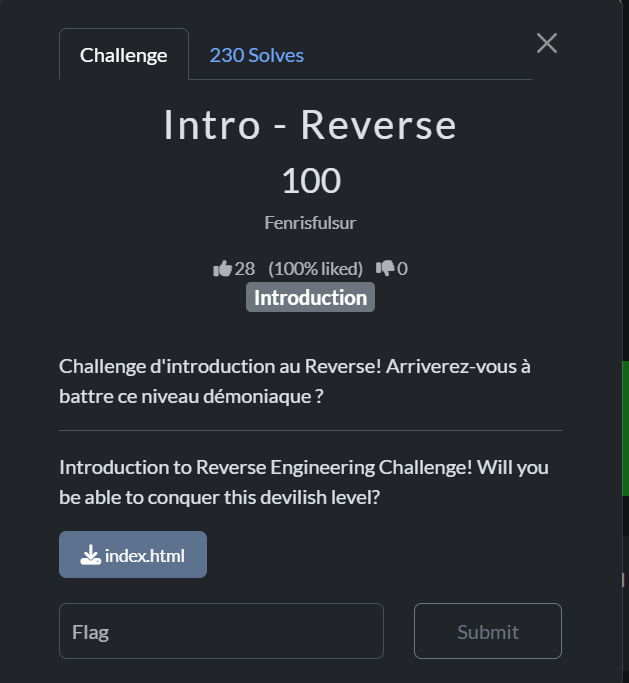
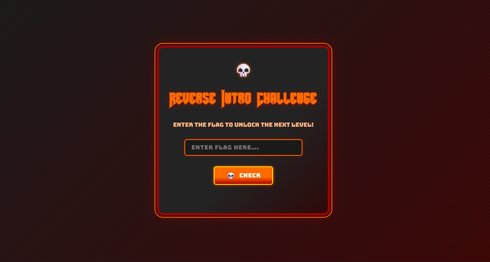
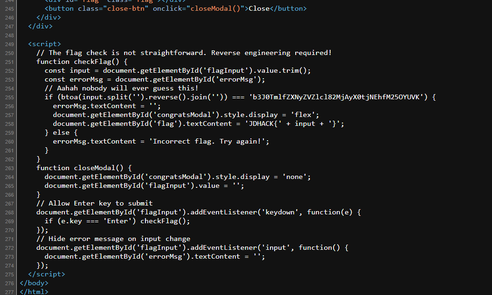

**Yêu cầu:**  

  

Mở file html, ta tới một trang web yêu cầu nhập flag:  

  

Thử xem source code trang web, ta thấy một đoạn code JavaScript để kiểm tra flag. Ta cần reverse hàm `checkFlag()`:  

  

```javascript
// The flag check is not straightforward. Reverse engineering required!
function checkFlag() {
    const input = document.getElementById('flagInput').value.trim();
    const errorMsg = document.getElementById('errorMsg');
    // Aahah nobody will ever guess this!
    if (btoa(input.split('').reverse().join('')) === 'b3J0TmlfZXNyZVZlcl82MjAyX0tjNEhfM25OYUVK') {
        errorMsg.textContent = '';
        document.getElementById('congratsModal').style.display = 'flex';
        document.getElementById('flag').textContent = 'JDHACK{' + input + '}';
    } else {
    err gain!';
    }
}
```  

Logic của hàm `checkFlag()` khá đơn giản. Flag được đảo ngược qua `.reverse().join('')`. Sau đó nó mã hoá qua hệ `base64` bằng hàm `btoa()`.  

Nếu Flag mã hoá bằng `b3J0TmlfZXNyZVZlcl82MjAyX0tjNEhfM25OYUVK` thì ta web sẽ in ra flag. Về cơ bản nhiệm vụ cần làm là từ xâu này, ta dịch ngược về để lấy flag.  

Tôi có viết một script python để làm việc này:  

```python
import base64


def solve_challenge(encoded_string):
    try:
        # Bước 1: Giải mã Base64 (tương đương với việc đảo ngược btoa)
        decoded_bytes = base64.b64decode(encoded_string)
        decoded_str = decoded_bytes.decode("utf-8")

        # Bước 2: Đảo ngược chuỗi (tương đương với .reverse().join(''))
        # Trong Python, [::-1] là cách nhanh nhất để lật ngược một chuỗi
        flag = decoded_str[::-1]

        return flag
    except Exception as e:
        return f"Có lỗi xảy ra: {e}"


# Chuỗi mục tiêu từ code của bạn
target = "b3J0TmlfZXNyZVZlcl82MjAyX0tjNEhfM25OYUVK"

result = solve_challenge(target)
print(f"Flag: {result}")
```

Flag: `JDHACK{JEaNn3_H4cK_2026_reVerse_iNtro}
`