# Level 1
Yêu cầu:  

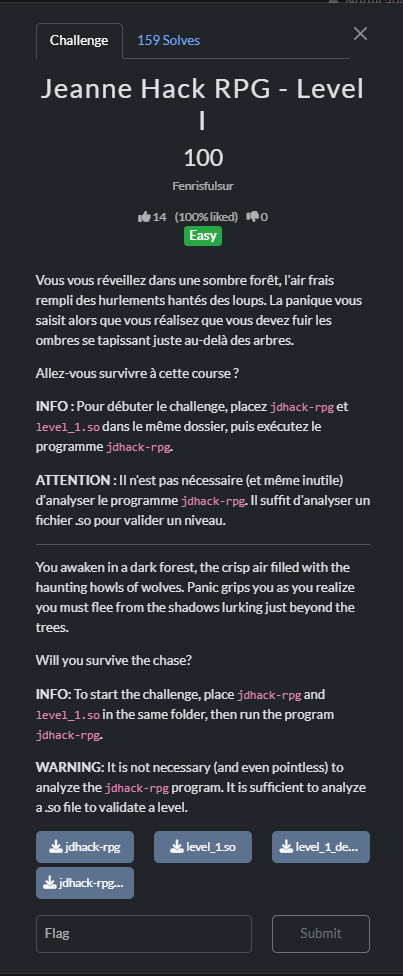

Một số thông tin tổng quan:  

  

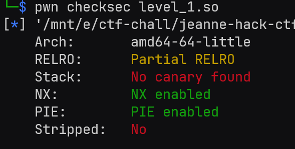 

Theo hint thì ta không cần quan tâm tới file `jdhack-rpg`. Tôi cũng đã thử decompile nó bằng Ghidra nhưng không có gì thú vị.  

Decompile `level_1.so` với Ghidra. Việc đầu tiên là check xem có chuỗi `JDHACK` trong đó không. Và rất may là có:  

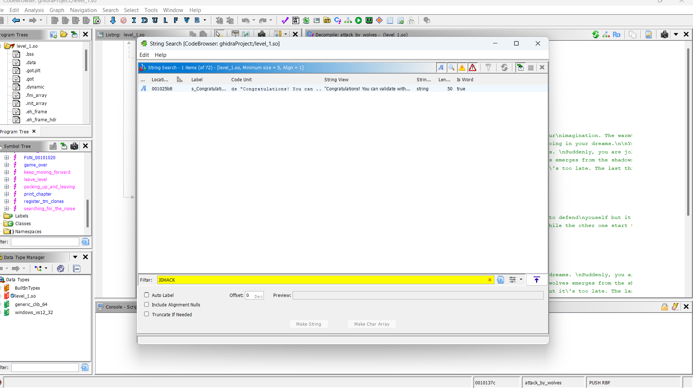  

Chuỗi này được gọi ở hàm `enter_village(char*)`:  

```c

void enter_village(char *param_1) {
  // ... 
  snprintf(local_408,0x400,"Congratulations! You can validate with\nJDHACK{%s}",param_1);
  window_msg(local_408);
  return;
}
```  

Hàm `enter_village()` này sẽ in ra nội dung full của flag, ta cần tìm xem chuỗi `param_1` là gì. Xem cross-reference, ta biết được hàm `enter_village()` này được gọi ở hàm `keep_moving_forward()`.  


```c

void keep_moving_forward(void) {
  // ...
    if (local_c == 0x30) {
      window_clear();
      sus_str = (char *)window_prompt("What is the secret code: ");
      pcVar4 = strdup(sus_str);
      pcVar4 = (char *)enc(pcVar4);
      iVar1 = strcmp("B1ofs@urX1t4tswhwDeM2w2m1od",pcVar4);
      if (iVar1 == 0) {
        choices_dispose(uVar2);
        free(pcVar4);
        enter_village(sus_str);
        return;
      }
      choices_dispose(uVar2);
      free(pcVar4);
      attack_by_wolves(2);
      return;
    }
    if ((local_c == 0x1b) || (local_c == 0x71)) break;
    window_msg("I did not understand what you are saying");
  }
  choices_dispose(uVar2);
  return;
}
```  

Hàm này thực hiện những việc sau:
- Nhập vào `sus_str` (biến này đã được tôi đổi tên). `pcVar4` copy giá trị của xâu `sus_str`.
- Mã hoá xâu `pcVar4` qua hàm `enc()`.
- So sánh xâu `pcVar4` đã mã hoá với xâu `B1ofs@urX1t4tswhwDeM2w2m1od`. Nếu 2 xâu bằng nhau thì gọi hàm `enter_village(sus_str)`.

Như vậy ta cần kiểm tra hàm `enc()` mã hoá xâu thế nào, từ đó đảo ngược mã hoá xâu `B1ofs@urX1t4tswhwDeM2w2m1od` để lấy được xâu `sus_str` chính xác.  

Rất may mắn là hàm `enc()` mã hoá khá đơn giản.  

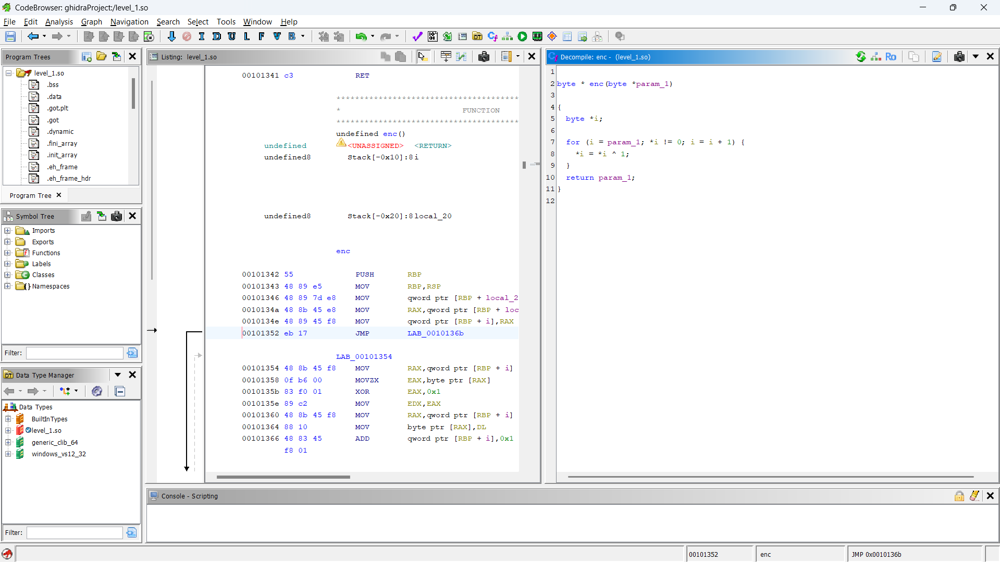  

```c
byte * enc(byte *param_1) {
  byte *i;
  for (i = param_1; *i != 0; i = i + 1) {
    *i = *i ^ 1;
  }
  return param_1;
}
```  

Logic hàm `enc()` là duyệt qua từng ký tự trong xâu `param_1` (hay chính là xâu `sus_str`). Sau đó XOR từng ký tự đó với `1`.  

Để đảo ngược ta chỉ cần XOR từng ký tự trong xâu kết quả với `1` là xong. Tôi viết một python script để tự động hoá việc này.

```py
def decrypt(encoded_data):
    # Nếu đầu vào là chuỗi, chuyển thành bytearray để có thể chỉnh sửa
    if isinstance(encoded_data, str):
        data = bytearray(encoded_data, "utf-8")
    else:
        data = bytearray(encoded_data)

    # Duyệt qua từng byte và thực hiện XOR 1 (giống hệt hàm enc)
    for i in range(len(data)):
        data[i] = data[i] ^ 1

    return data

encoded_bytes = (
    b"B1ofs@urX1t4tswhwDeM2w2m1od"  
)

decrypted_data = decrypt(encoded_bytes)

print(f"Dữ liệu sau khi giải mã: {decrypted_data.decode('utf-8')}")
```  

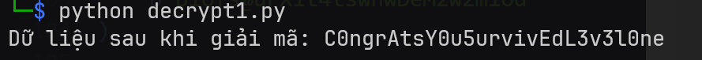  

Flag: `JDHACK{C0ngrAtsY0u5urvivEdL3v3l0ne}`  

# Level 2

Yêu cầu:  

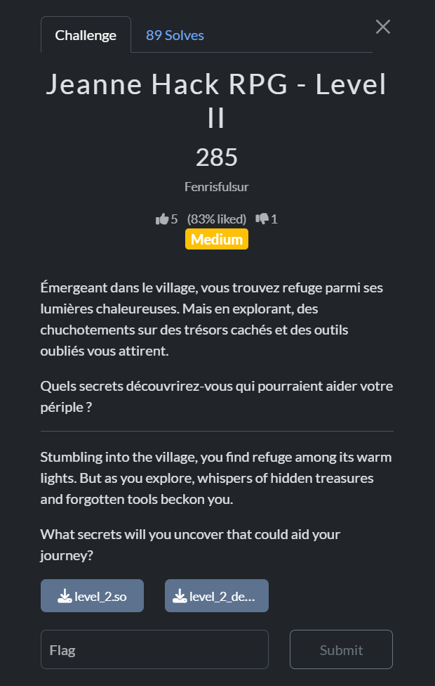  

Một số thông tin cơ bản:  

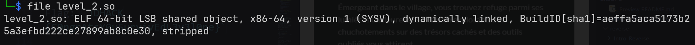  

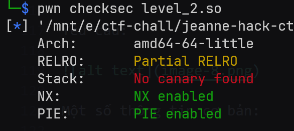  

Challenge này có file bị `strip`, nên việc reverse sẽ hơi khó khăn. Lại kịch bản cũ, ta tìm xem có xâu `JDHACK` không. Rất may mắn là lại có =)). Xâu này được gọi ở hàm `sus_func()` (đã đổi tên).

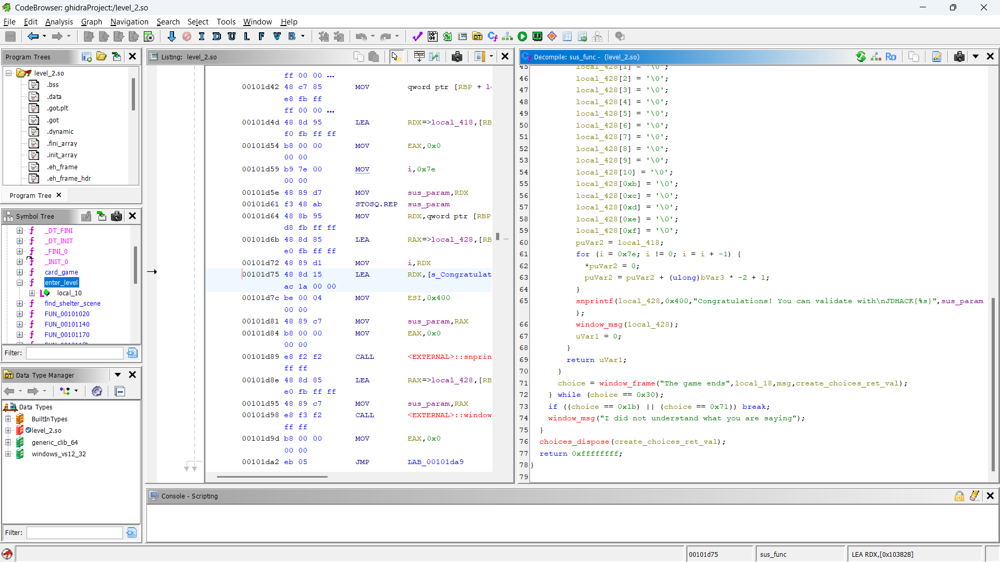  

Hàm `sus_func()` này yêu cầu `sus_param` chính xác thì mới in ra flag chuẩn. `sus_func()` được gọi ở hàm `card_game()`.  

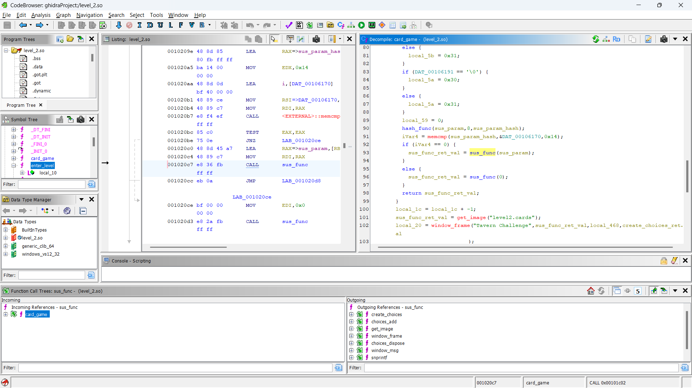  

Ta cần quan tâm đến đoạn code sau trong hàm `card_game()`.  

```c
hash_func(sus_param,8,sus_param_hash);
iVar4 = memcmp(sus_param_hash,&DAT_00106170,0x14);
if (iVar4 == 0) {
  sus_func_ret_val = sus_func(sus_param);
}
else {
  sus_func_ret_val = sus_func(0);
}
return sus_func_ret_val;
```  

Đoạn code này thực hiện hash biến `sus_param`, trả về `sus_param_hash`. Sau đó so sánh 20 byte đầu `sus_param_hash` với `&DAT_00106170`, nếu bằng nhau thì gọi `sus_func(sus_param)`.  

Nhiệm vụ tôi cần làm là crack hàm `hash_func()`. Nhưng hàm này rất dài và khó crack được.  

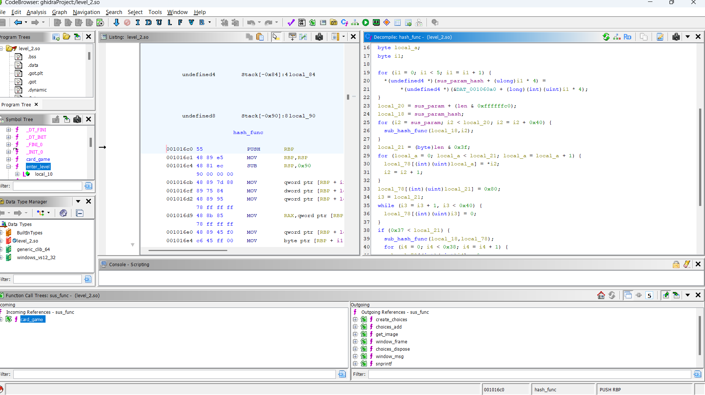  

Tôi xem thử giá trị của `&DAT_00106170`.  

```asm
                             DAT_00106170                                    XREF[2]:     card_game:001020aa (*) , 
                                                                                          card_game:001020b1 (*)   
        00106170 e1              ??         E1h
        00106171 51              ??         51h    Q
        00106172 67              ??         67h    g
        00106173 57              ??         57h    W
        00106174 d5              ??         D5h
        00106175 87              ??         87h
        00106176 9a              ??         9Ah
        00106177 29              ??         29h    )
        00106178 61              ??         61h    a
        00106179 bf              ??         BFh
        0010617a 5d              ??         5Dh    ]
        0010617b fd              ??         FDh
        0010617c 44              ??         44h    D
        0010617d 13              ??         13h
        0010617e 7e              ??         7Eh    ~
        0010617f 75              ??         75h    u
        00106180 ef              ??         EFh
        00106181 0f              ??         0Fh
        00106182 f5              ??         F5h
        00106183 fa              ??         FAh

```  

Sắp xếp lại ta có được dãy byte: `e1 51 67 57 d5 87 9a 29 61 bf 5d fd 44 13 7e 75 ef 0f f5 fa`.  

Thấy dài dài thế này là cảm thấy căng rồi. Phải nghĩ ngay đếm hàm `hash`. Dù sao thì tôi thử lên crackstation để check xem sao, và tôi được dãy số `02100101`. May mắn thay, đây là flag.  

Loại hash sử dụng (theo crackstation) là `ripemd160`.

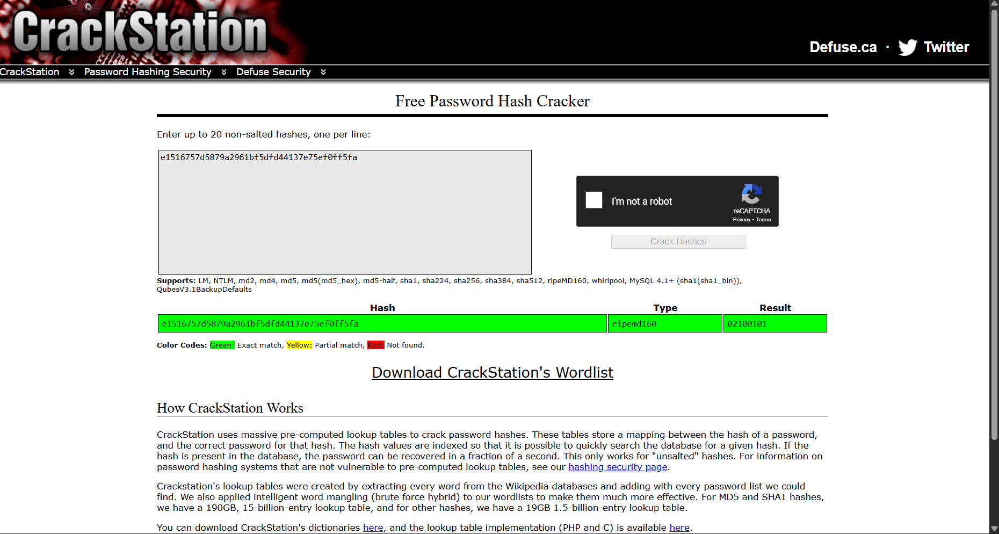  

Flag: `JDHACK{02100101}`


