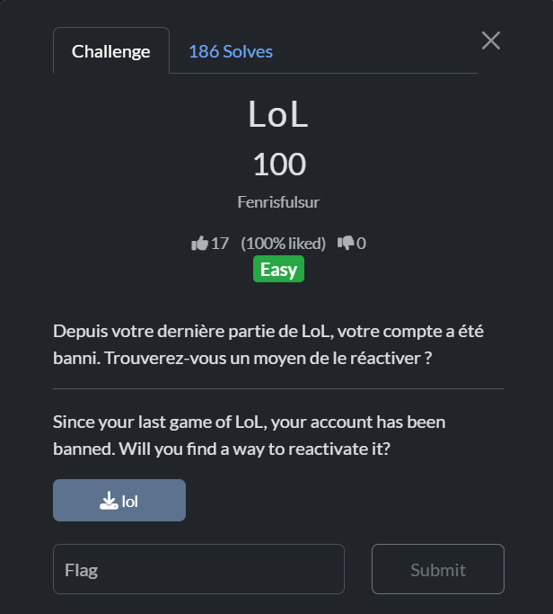
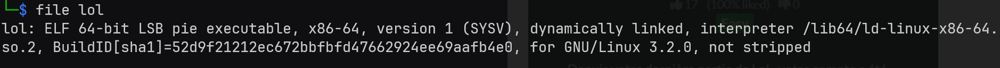
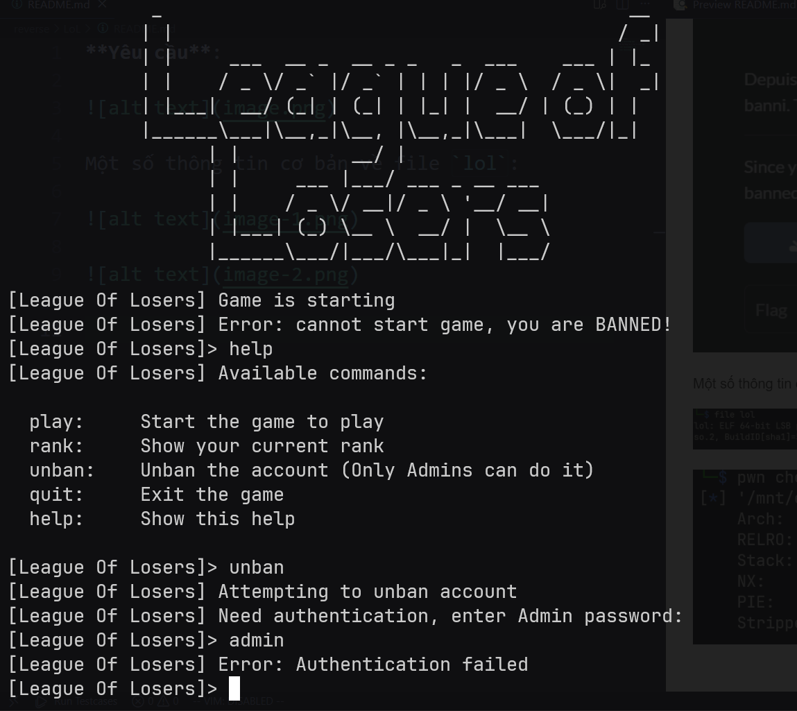
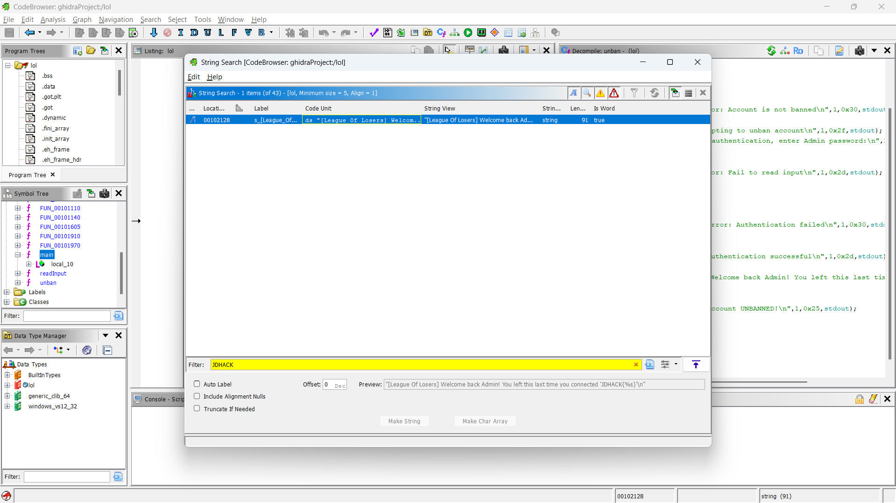
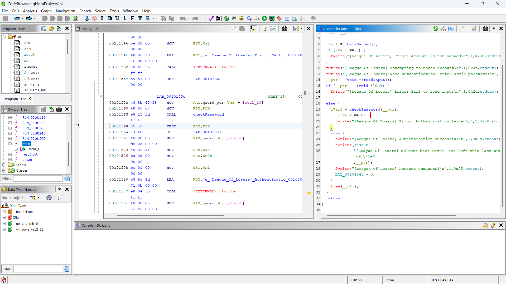
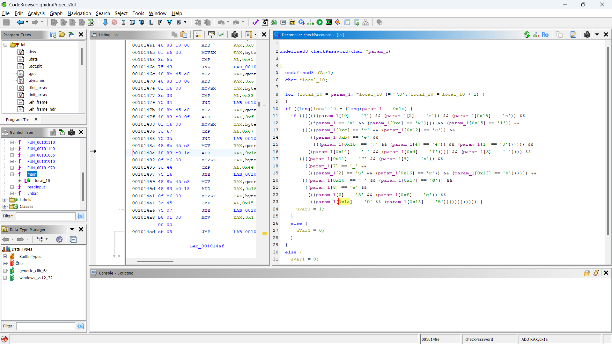

**Yêu cầu**:  

  

Một số thông tin cơ bản về file `lol`:  

  

  

Có vẻ như nhiệm vụ của tôi là phải unban người dùng. Để làm được điều đó tôi cần tìm được password của admin:  

  

Dùng `ghidra` để decompile, trước hết tôi kiểm tra xem có xâu `JDHACK` tồn tại không. Rất may mắn là có.  

  

Và xâu này được sử dụng ở hàm `unban()`:  



Đặc biệt chú ý đến đoạn sau trong hàm `unban()`:  

```c
  else {
    iVar1 = checkPassword(__ptr);
    if (iVar1 == 0) {
      fwrite("[League Of Losers] Error: Authentication failed\n",1,0x30,stdout);
    }
    else {
      fwrite("[League Of Losers] Authentication successful\n",1,0x2d,stdout);
      fprintf(stdout,
              "[League Of Losers] Welcome back Admin! You left this last time you connected \'JDHACK {%s}\'\n"
              ,__ptr);
      fwrite("[League Of Losers] Account UNBANNED!\n",1,0x25,stdout);
      DAT_00104340 = 0;
    }
    free(__ptr);
  }
```  

Như vậy để in ra đầy đủ flag, ta cần tìm được giá trị biến `__ptr` chính xác. Biến này có kiểu `char*` và được truyền vào hàm `checkPassword()`. 63,36% đây là biến `password` lưu password của admin mà user nhập. Ta cần xem hàm `checkPassword()`.  

  

```c

undefined8 checkPassword(char *param_1)

{
  undefined8 uVar1;
  char *local_10;
  
  for (local_10 = param_1; *local_10 != '\0'; local_10 = local_10 + 1) {
  }
  if ((long)local_10 - (long)param_1 == 0x1c) {
    if (((((((param_1[10] == '7') && (param_1[5] == 'r')) && (param_1[0x19] == 'n')) &&
          ((*param_1 == 'y' && (param_1[0xe] == 'N')))) && (param_1[0x15] == 'l')) &&
        (((((param_1[0xc] == 'r' && (param_1[0x12] == 'H')) &&
           ((param_1[0xb] == 'e' &&
            (((param_1[0x1b] == '!' && (param_1[4] == '4')) && (param_1[1] == '0')))))) &&
          ((param_1[0x14] == '_' && (param_1[0xd] == 'I')))) && (param_1[3] == '_')))) &&
       ((((param_1[0x11] == '7' && (param_1[9] == 'n')) &&
         ((param_1[7] == '_' &&
          (((param_1[2] == 'u' && (param_1[0x16] == 'E')) && (param_1[0x13] == 'e')))))) &&
        (((param_1[0x10] == '_' && (param_1[0x17] == 'G')) &&
         ((param_1[8] == 'e' &&
          (((param_1[6] == '3' && (param_1[0xf] == 'g')) &&
           ((param_1[0x1a] == 'D' && (param_1[0x18] == 'E')))))))))))) {
      uVar1 = 1;
    }
    else {
      uVar1 = 0;
    }
  }
  else {
    uVar1 = 0;
  }
  return uVar1;
}
```

Như vậy password (hay flag) được hardcode trong lệnh `if` của hàm `checkPassword()` này. Ta sắp xếp lại cho đúng thứ tự và nhận được flag.  

Flag: `JDHACK{y0u_4r3_en7erINg_7He_lEGEnD!}`

